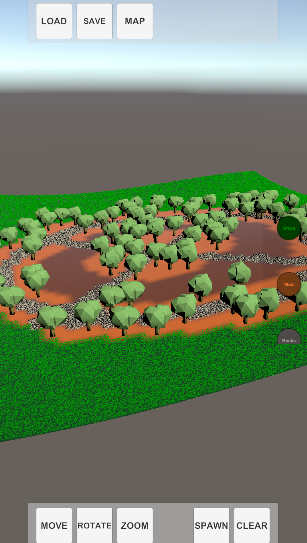
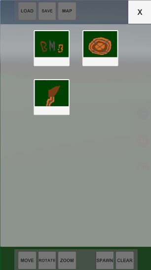
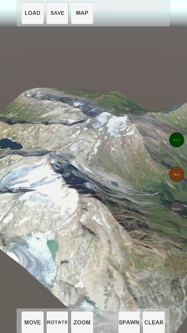

# Runtime Terrain Editor
This packages implementations a runtime terrain editor.

## Features
### Paint and Preview
#### Create a terrain.
#### Paint the terrain.  
  
Sample low-poly tree modified asset from [Free 3D](https://free3d.com)
#### Define configurations for terrain painting.
#### Save / Load terrain.  

#### Load heightmaps  
  
Sample heightmap from [3D Mapper](https://3d-mapper.com)

## Related Documents
- [Main Documentation Page](Documentation~/com.bitmoksha.terrain.md)
- [Changelog](CHANGELOG.md)

## External links
- [Test tree asset](https://free3d.com/3d-model/low-poly-tree-449895.html)